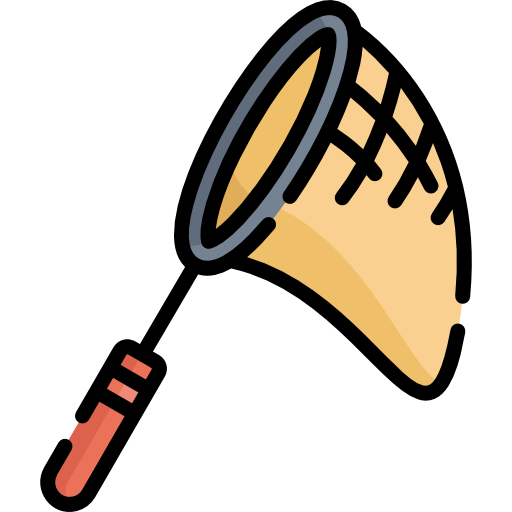

# Catch The Spy

Welcome to Catch The Spy game! This game challenges you to catch a certian amount of spies hidden among the holes before the timer runs out.

## Demo

[Link to the live demo](#)


## How to Play

1. **Select Difficulty:** Choose the difficulty level (Easy, Medium, or Hard) based on the number of spies you need to catch.
2. **Start Game:** Click the "START GAME" button to begin the game.
3. **Catch the Spy:** Click on the hole where you think the spy is hiding. If you catch the spy, your score increases.
4. **Win or Lose:** You have a limited time to catch the spy. If you catch enough spies before the timer runs out, you win. Otherwise, you lose the game.

## Rules

- **Easy Mode:** Catch 50 spies to win.
- **Medium Mode:** Catch 25 spies to win.
- **Hard Mode:** Catch 10 spies to win.

## Features

- Three difficulty levels to choose from.
- Real-time game timer to keep track of remaining time.
- Dynamic spy movement to keep the game challenging.
- Background music to enhance the gaming experience.

## Technologies Used

- **HTML:** Structured the game layout and content.
- **CSS:** Styled the game elements for better user experience.
- **JavaScript:** Implemented game logic and interactivity.

## Acknowledgments

- [Spy Image](https://www.cleanpng.com/png-rowan-atkinson-png-55414/)

- [Music for the game](https://www.youtube.com/watch?v=U9FzgsF2T-s&ab_channel=TheAmericanGazette)

- [Font for Game](https://fonts.google.com/)
## Wire Frame


## Game Code Details

### JavaScript Logic
- JavaScript code handles game logic, such as spy movement, user interactions, score tracking, and timer management.
- Event listeners are used to detect user clicks on holes and start button clicks.
- The game dynamically adjusts difficulty based on the selected mode (Easy, Medium, Hard).
- The `mousemove` event listener tracks cursor movement and displays a custom cursor image.
- Background music is played using the `audio` HTML element and JavaScript `play()` method.


### This function decrements the gameTime variable representing the game timer. It updates the text content of the time element to display the remaining game time.
- It evaluates the game result based on the difficulty level (easySpeed, mediumSpeed, hardSpeed) and the player's score (result).
- Updates the endResult element to display whether the player wins or loses.
- Clears the game timer and spy movement intervals.
- Resets the game by setting the timer variable to null and resetting the result variable to zero.
```js
const countDown = () => {
    gameTime--
    time.textContent = `Game Timer: ${gameTime}`

    if (gameTime === 0) {
        console.log(result, easySpeed, mediumSpeed);
        if (easySpeed === true) {
            if (result >= 50) {
                endResult.textContent = "WINNER!"
            } else {
                endResult.textContent = 'LOSER!'
            } 
        } else if ( mediumSpeed === true) {
            if (result >= 25) {
                endResult.textContent = "WINNER!"
            } else {
                endResult.textContent = 'LOSER!'
            }
        } else if ( hardSpeed === true) {
            if (result >= 10) {
                endResult.textContent = "WINNER!"
            } else {
                endResult.textContent = "LOSER!"
            }
        }
        // this code resets the game
        clearInterval(timer)
        clearInterval(spyMovement)
        timer = null
        result = 0
    }
}
```
moveSpy Function:
This function sets up an interval (spyMovement) to repeatedly call the randomHole function, which randomly selects a hole for the spy to appear.

```js
const moveSpy = () => {
    spyMovement = setInterval(randomHole, gameSpeed)
}

const startGameButton = () => {
    if (timer) return;

    result = 0;
    score.textContent = `Your Score: ${result}`;

    gameTime = 60;
    time.textContent = `Game Timer: ${gameTime}`;
    timer = setInterval(countDown, 1000);

    moveSpy();
    countDown()
    audio.play()
}
```

- This event listener is attached to the "click" event of the "EASY" button (easy), which is used to select the easy difficulty level in the game.
```js
easy.addEventListener('click', () => {
    gameSpeed = 1000
    hardSpeed = false
    mediumSpeed = false
    easySpeed = true
    console.log("working ", easySpeed, mediumSpeed);

})
```
### HTML Structure
- The game layout and elements are structured using HTML, including buttons, score display, timer, and holes where spies can hide.

```html
<body>
    <div class="end-game-message"></div>
        <div class="button-container">
            <button class="gamestart"> START GAME</button>
            <button class="easybutton"> EASY</button>
            <button class="mediumbutton"> MEDIUM </button>
            <button class="hardbutton"> HARD </button>
        </div>
        <div class="game">
        <div class="score-timer">
            <h2 class="score">Your Score: </h2>
            <h2 class="gametime"></h2>
        </div>
        <div class="hole" id="1"></div>
        <div class="hole" id="2"></div>
        <div class="hole" id="3"></div>
        <div class="hole" id="4"></div>
        <div class="hole" id="5"></div>
        <div class="hole" id="6"></div>
        <div class="hole" id="7"></div>
        <div class="hole" id="8"></div>
        <div class="hole" id="9"></div>
        </div>
    <div class="cursor">
        
    </div>
</body>
```

### CSS Styling
- CSS styles are applied to enhance the appearance of game elements, including fonts, colors, and layouts.

```css
.game-title {
	color: greenyellow;
	display: flex;
	justify-content: flex-end;
	width: 44vw;
	font-size: 45px;
	font-family: "Pacifico", cursive;
	font-weight: 400;
	font-style: normal;
}
.score-timer {
	width: 800px;
	display: flex;
	flex-direction: column-reverse;
    justify-content: space-around;
    flex-wrap: wrap;
    align-items: stretch;
    align-content: space-around;
}
```

